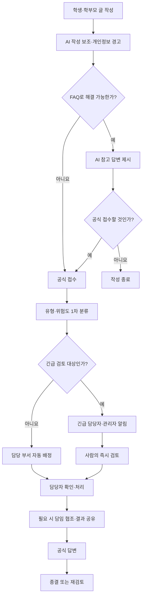

# 학교소통안심함 PRD

> 학생·학부모의 문의와 학교생활 갈등을 적절한 담당 부서에 안전하게 연결하고, 담임교사의 민원 응대 부담을 줄이기 위한 비공개 통합 소통 시스템

---

## 1. 문서 정보

| 항목 | 내용 |
|---|---|
| 문서명 | 학교소통안심함 제품 요구사항 정의서(PRD) |
| 버전 | v1.0 |
| 주요 사용자 | 학생, 학부모, 담임교사, 업무 담당교사, 학교 관리자 |
| 서비스 형태 | 반응형 웹앱(PC·태블릿·모바일) |
| 핵심 목적 | 접수 창구 일원화, 담당 부서 중심 처리, 담임교사 부담 완화, 처리 과정 기록, 개인정보 보호 |
| 가칭 | 학교소통안심함 |

---

## 2. 개발 배경

현재 학생 간 갈등, 학교생활 문의, 행정 요청, 수업 및 평가 문의 등이 대부분 담임교사에게 전화나 메시지로 전달된다. 담임교사는 사안의 실제 담당자가 아닌 경우에도 내용을 듣고 정리한 뒤 담당 부서를 찾고, 진행 상황과 결과까지 다시 안내해야 한다.

이 과정에서 다음과 같은 문제가 발생한다.

- 담임교사에게 문의와 민원이 집중된다.
- 전화 중심 소통으로 인해 업무 흐름이 자주 중단된다.
- 전달 과정에서 내용이 축약되거나 달라질 수 있다.
- 사안별 담당 부서와 처리 책임이 불명확하다.
- 처리 과정과 답변 이력이 체계적으로 남지 않는다.
- 작성자는 현재 어떤 부서에서 처리하고 있는지 알기 어렵다.
- 학생 간 갈등처럼 전문적 중재가 필요한 사안까지 담임 개인이 감당하게 된다.

학교소통안심함은 학생과 학부모가 문의·요청·갈등 사안을 비공개로 접수하고, 학교가 이를 유형별 담당 부서에 배정하여 처리하는 공식 소통 창구를 지향한다.

---

## 3. 문제 정의

### 3.1 해결할 핵심 문제

1. 모든 문의가 담임교사에게 먼저 전달되는 구조
2. 사안별 담당 부서가 명확하지 않아 발생하는 반복 전달
3. 전화와 개인 메시지 중심 소통으로 인한 기록 누락
4. 접수 이후 처리 상태를 확인하기 어려운 문제
5. 학생·학부모 개인정보와 민감정보가 불필요하게 공유되는 문제
6. 단순 문의와 학교폭력·안전·위기 사안이 동일한 방식으로 처리되는 문제

### 3.2 제품이 해결하지 않는 문제

- 112·119가 필요한 긴급 상황의 직접 대응
- 학교폭력 여부에 대한 AI의 판단 또는 확정
- 법률·의료·심리 진단
- 교직원 개인에 대한 공개 평가 또는 비방
- 학생 간 자유로운 공개 커뮤니티 운영
- 학교의 공식 절차를 거치지 않은 익명 폭로 게시판 운영

---

## 4. 서비스 목표

### 4.1 핵심 목표

- 학생·학부모의 학교 관련 문의 접수 창구를 일원화한다.
- 접수된 사안을 적절한 담당 부서에 신속하게 배정한다.
- 담임교사는 필요한 사안의 진행 과정과 결과만 공유받도록 한다.
- 접수, 배정, 처리, 답변, 종결의 전 과정을 기록한다.
- 학생과 학부모의 개인정보를 역할과 업무 범위에 따라 보호한다.
- AI를 활용하여 글쓰기와 분류를 돕되 최종 판단과 공식 답변은 사람이 담당한다.

### 4.2 성공 기준

- 담임교사에게 직접 들어오는 비담임 업무 문의 감소
- 미배정·장기 미처리 게시글 감소
- 문의 유형별 평균 최초 응답 시간 단축
- 작성자의 처리 상태 확인 가능 비율 증가
- 동일 사안의 반복 설명 및 부서 간 재전달 감소
- 민감 게시글의 무관계자 열람 0건 유지

---

## 5. 핵심 운영 원칙

1. **담임 비우선 원칙**: 담임교사는 모든 게시글의 기본 접수자나 책임자가 아니다.
2. **담당 부서 책임 원칙**: 사안의 성격에 맞는 담당 부서가 접수 이후의 처리와 공식 답변을 책임진다.
3. **필요 최소 공유 원칙**: 담임과 관계 교직원에게는 업무상 필요한 범위만 공유한다.
4. **사람의 최종 판단 원칙**: AI는 보조 기능만 수행하며 접수 거부, 사안 확정, 공식 답변, 종결을 단독 결정하지 않는다.
5. **기록과 추적 원칙**: 열람, 배정, 이관, 답변, 수정, 종결 이력을 남긴다.
6. **긴급 사안 우선 원칙**: 안전·자해·폭력·학대·성 관련 위기 가능성이 있는 글은 일반 문의와 분리한다.
7. **처리 기한 원칙**: 접수 유형별 최초 확인 및 답변 목표 시간을 설정한다.
8. **비공개 기본 원칙**: 모든 접수 글은 기본적으로 작성자와 권한이 있는 담당자만 열람한다.

---

## 6. 사용자 유형 및 권한

| 사용자 | 주요 권한 | 제한 사항 |
|---|---|---|
| 학생 | 본인 인증, 글 작성, 첨부, 상태 확인, 추가 답변, 결과 확인 | 다른 학생의 글과 담당자 내부 기록 열람 불가 |
| 학부모 | 보호자 인증, 자녀 연결, 글 작성, 상태 확인, 결과 확인 | 연결되지 않은 학생 정보와 내부 처리 의견 열람 불가 |
| 담임교사 | 공유 지정된 사안의 요약·결과 확인, 협조 요청 응답 | 모든 학부모 글 자동 열람 불가, 기본 처리 책임 없음 |
| 담당교사 | 배정 사안 열람, 처리 기록, 답변, 이관, 협조 요청 | 담당 범위 밖 민감 사안 열람 불가 |
| 부서 책임자 | 부서 게시글 배정, 담당자 변경, 답변 검토, 지연 관리 | 타 부서 전체 글 열람은 별도 권한 필요 |
| 총괄 관리자 | 유형·부서·권한 설정, 미배정 관리, 통계, 감사 로그 확인 | 민감정보 열람은 사유와 기록 필요 |
| 시스템 관리자 | 계정·기술 환경 관리 | 게시글 본문은 원칙적으로 열람하지 않으며 필요 시 승인·기록 필요 |

### 6.1 인증 정책

- 학생: 학교 계정 또는 학교 발급 인증코드
- 학부모: 학교 발급 보호자 인증코드 또는 학생 정보 연계 인증
- 교직원: 교직원 계정과 관리자 승인
- 한 학부모가 여러 자녀를 자녀별로 연결할 수 있도록 지원
- 자유 회원가입과 완전 익명 접수는 기본적으로 허용하지 않음
- 비밀번호 재설정, 다중 로그인 감지, 일정 시간 미사용 시 자동 로그아웃 지원
- 관리자와 민감 사안 담당자는 2단계 인증 적용 권장

---

## 7. 접수 유형 및 담당 부서 매핑

학교 관리자는 실제 학교 조직에 맞게 유형, 담당 부서, 처리 기한, 담임 공유 기준을 수정할 수 있어야 한다.

| 접수 유형 | 담당 부서 예시 | 기본 우선순위 | 담임 공유 기본값 |
|---|---|---:|---|
| 학생 간 갈등 | 학생생활·갈등중재 담당 | 높음 | 처리 결과 공유 |
| 학교폭력 우려 | 학교폭력 담당 | 긴급 검토 | 협조 요청 또는 결과 공유 |
| 학생 안전·위기 | 학생안전·상담·관리자 | 긴급 | 사안별 결정 |
| 생활지도 | 학생생활 담당 | 보통 | 요약 공유 |
| 출결·학적 | 교무·학적 담당 | 보통 | 필요 시 공유 |
| 수업·평가 | 해당 교과·교육과정 담당 | 보통 | 필요 시 공유 |
| 자유학기·교육활동 | 교육과정·해당 업무 담당 | 보통 | 공유 불필요 |
| 급식 | 급식 담당 | 보통 | 공유 불필요 |
| 보건·건강 | 보건 담당 | 높음 | 민감정보 최소 공유 |
| 시설·환경 | 행정실·시설 담당 | 보통 | 공유 불필요 |
| 납부·행정 | 행정실 | 보통 | 공유 불필요 |
| 교육활동 제안 | 관련 업무 담당 | 낮음 | 공유 불필요 |
| 칭찬·감사 | 관리자 또는 해당 부서 | 낮음 | 필요 시 공유 |
| 단순 문의 | AI FAQ 또는 운영 담당 | 낮음 | 공유 불필요 |
| 기타 | 운영 총괄 | 보통 | 분류 후 결정 |

### 7.1 공유 수준

- 공유 불필요
- 접수 사실만 공유
- 핵심 요약 공유
- 처리 결과 공유
- 사실 확인 협조 요청
- 공동 처리 요청

---

## 8. 전체 처리 흐름

### 8.1 처리 상태

| 상태 | 설명 |
|---|---|
| 작성 중 | 작성자가 아직 제출하지 않은 임시 저장 상태 |
| 접수 완료 | 접수번호가 발급된 상태 |
| 분류 중 | 유형과 담당 부서를 확인하는 상태 |
| 담당자 배정 | 담당 부서와 담당자가 지정된 상태 |
| 확인 중 | 담당자가 사실과 관련 자료를 확인하는 상태 |
| 처리 중 | 중재, 안내, 협의 등 실질적 처리가 진행 중인 상태 |
| 추가 정보 요청 | 작성자 또는 관계자에게 자료를 요청한 상태 |
| 답변 검토 중 | 공식 답변을 부서 책임자 등이 검토하는 상태 |
| 답변 완료 | 작성자에게 공식 답변이 전달된 상태 |
| 종결 | 후속 처리가 종료된 상태 |
| 재검토 요청 | 작성자가 정해진 기간 내 재검토를 요청한 상태 |

---

## 9. 학생·학부모 기능

### 9.1 회원 및 자녀 연결

- 학교 구성원 인증
- 학부모-자녀 관계 연결
- 자녀가 여러 명인 경우 대상 자녀 선택
- 개인정보 수집·이용 및 AI 처리 동의
- 알림 수신 방법 설정

### 9.2 글 작성

- 문의 대상 자녀 선택
- 접수 유형 선택
- 제목 및 본문 작성
- 발생 일시·장소 입력
- 관련 인물은 필요할 때만 입력
- 원하는 해결 방향 선택 또는 직접 입력
- 사진·문서 등 첨부파일 등록
- 임시 저장
- 제출 전 미리보기
- 긴급 안내 확인
- 개인정보·다른 학생 실명 포함 여부 확인

### 9.3 AI 작성 보조

- 맞춤법과 띄어쓰기 수정
- 문장을 정중하고 명확하게 정리
- 감정적·공격적 표현의 순화 문장 제안
- 사건, 요청 사항, 희망 해결 방향을 구분하여 구조화
- 핵심 내용 누락 여부 질문
- 주민등록번호, 전화번호, 주소 등 민감정보 감지 경고
- 다른 학생의 실명이나 얼굴 정보 입력 시 주의 안내

AI가 수정한 문장은 작성자가 원문과 비교한 뒤 직접 적용하거나 되돌릴 수 있어야 한다.

### 9.4 접수 내역

- 접수번호 확인
- 접수 시각 확인
- 담당 부서 확인
- 현재 처리 상태 확인
- 예상 최초 답변 기한 확인
- 추가 정보 요청에 응답
- 공식 답변 확인
- 정해진 기간 내 재검토 요청
- 처리 만족도 선택

담당교사의 개인 연락처는 표시하지 않으며 필요 시 부서명만 노출한다.

---

## 10. 담당교사 기능

### 10.1 업무함

- 새로 배정된 글
- 확인하지 않은 글
- 긴급 검토 글
- 처리 기한 임박 글
- 기한 초과 글
- 추가 정보가 도착한 글
- 답변 검토가 필요한 글
- 처리 완료 글

### 10.2 게시글 처리

- 접수 내용과 첨부파일 열람
- AI 요약과 원문 함께 확인
- 유형·긴급도 수정
- 담당 부서 이관
- 다른 담당자에게 협조 요청
- 작성자에게 추가 정보 요청
- 내부 처리 메모 작성
- 공식 답변 작성 및 임시 저장
- 답변 검토 요청
- 처리 완료 및 종결

### 10.3 이관 정책

- 이관 사유 필수 입력
- 새 담당 부서가 수락하기 전까지 기존 부서가 책임 유지
- 작성자에게는 불필요한 내부 이동 과정 대신 현재 담당 부서와 상태만 안내
- 반복 이관 시 총괄 관리자에게 자동 알림

---

## 11. 담임교사 기능

담임교사의 업무 부담 감소라는 목적이 흐려지지 않도록 담임 화면은 별도로 단순하게 구성한다.

- 모든 게시글이 아닌 공유 지정 사안만 표시
- 접수 사실, 핵심 요약, 협조 요청, 처리 결과를 공유 수준에 따라 구분
- 협조 요청에 사실 확인 의견 작성
- 해당 사안의 담당 부서와 현재 상태 확인
- 처리 완료 알림 확인
- 담임에게 직접 답변 책임을 자동 부여하지 않음
- 학생 지도에 필요한 최소 정보만 제공
- 보건·상담·성 관련 민감정보는 별도 권한이 없으면 상세 내용 비공개

### 11.1 담임 알림 예시

- `학생생활지원부에서 학생 간 갈등 사안을 확인 중입니다. 담임 의견이 필요합니다.`
- `접수된 사안의 처리가 완료되었습니다. 학생 지도에 필요한 결과 요약을 확인해 주세요.`
- `담임 협조가 필요하지 않은 사안입니다. 처리 결과만 추후 공유됩니다.`

---

## 12. 관리자 기능

### 12.1 운영 대시보드

- 전체 접수 건수
- 유형별 접수 건수
- 미배정 건수
- 긴급 검토 건수
- 담당자 미확인 건수
- 처리 기한 임박·초과 건수
- 부서별 평균 최초 응답 시간
- 부서별 평균 종결 시간
- 반복 이관 건수
- 재검토 요청 건수

### 12.2 운영 설정

- 접수 유형 추가·수정·비활성화
- 유형별 담당 부서 지정
- 담당자와 대체 담당자 지정
- 유형별 처리 기한 설정
- 담임 공유 기본값 설정
- 긴급 키워드 및 알림 대상 설정
- 공휴일·업무시간 설정
- FAQ와 학교 규정 자료 관리
- 알림 문구와 자동 안내문 관리
- 보존 기간 및 파기 정책 설정

### 12.3 감사 및 보안

- 게시글 열람 이력
- 담당자 배정·변경 이력
- 부서 이관 이력
- 답변 수정·승인 이력
- 파일 다운로드 이력
- 관리자 권한 변경 이력
- 민감정보 열람 사유 기록

---

## 13. AI 기능 요구사항

### 13.1 허용 기능

- 맞춤법·띄어쓰기 교정
- 문장 정리와 표현 순화
- 내용 요약
- 접수 유형과 담당 부서 추천
- 긴급 검토가 필요한 표현 감지
- 개인정보·민감정보 포함 가능성 경고
- 학교 FAQ·규정에 근거한 1차 안내
- 담당자의 공식 답변 초안 작성 보조
- 유사한 반복 문의 표시

### 13.2 금지 기능

- 학교폭력 여부 확정
- 학생·학부모의 거짓말 여부 판단
- 가해자·피해자 단정
- 심리·의료·법률적 진단
- AI 단독 접수 거부 또는 자동 종결
- AI 단독 공식 답변 발송
- 민감 사안의 무인 자동 처리
- 출처가 없는 학교 규정 생성

### 13.3 AI 답변 원칙

- AI 답변에는 `참고용 안내이며 학교의 공식 답변이 아닙니다`라고 표시한다.
- 학교가 등록한 FAQ, 공지, 규정의 근거를 함께 보여준다.
- 근거가 없거나 확실하지 않으면 추측하지 않고 공식 접수를 안내한다.
- AI 답변으로 궁금증이 해결되어도 사용자가 원하면 공식 접수를 계속할 수 있다.
- AI 서비스에 전송하기 전에 불필요한 개인정보를 마스킹한다.

---

## 14. 긴급·위기 사안 대응

### 14.1 긴급 안내

글 작성 화면과 제출 직전에 다음 내용을 안내한다.

> 이 서비스는 실시간 긴급 신고 수단이 아닙니다. 현재 신체적 위험이 있거나 즉시 도움이 필요한 경우 112·119 또는 학교의 긴급 연락처를 이용해 주세요.

### 14.2 긴급 검토 후보

- 자해·자살 위험 표현
- 신체적 폭력 또는 위협
- 성폭력·성희롱 관련 내용
- 아동학대 의심 내용
- 흉기·범죄·실종 관련 내용
- 즉각적인 의료 지원이 필요한 내용
- 보복 또는 추가 피해 가능성이 큰 내용

### 14.3 처리 원칙

- AI는 긴급 가능성을 표시할 뿐 확정하지 않는다.
- 긴급 후보 글은 지정 담당자와 관리자에게 즉시 알린다.
- 담당자가 직접 확인하고 학교 위기 대응 절차를 적용한다.
- 일반 게시글보다 열람 권한을 더욱 제한한다.
- 알림 실패 시 대체 담당자에게 단계적으로 재알림한다.
- 긴급 알림의 발송·수신·확인 시각을 기록한다.

---

## 15. 개인정보 및 보안 요구사항

### 15.1 개인정보 최소 수집

- 서비스 운영에 필요한 정보만 수집
- 주민등록번호는 수집하지 않음
- 학생 실명과 학급 정보는 필요한 업무에만 사용
- 다른 학생의 개인정보 입력 최소화 안내
- 선택 입력과 필수 입력을 명확히 구분

### 15.2 접근 통제

- 역할 기반 접근 제어 적용
- 담당 부서와 협조 요청을 받은 교직원만 원문 열람
- 담임은 공유 수준에 맞는 정보만 열람
- 민감 사안은 추가 권한 또는 책임자 승인 적용
- 일정 시간 미사용 시 자동 로그아웃
- 관리자 계정의 2단계 인증 적용 권장

### 15.3 데이터 보호

- 전송 구간 암호화
- 저장 데이터 및 첨부파일 암호화
- 비밀번호는 안전한 단방향 해시 방식으로 저장
- 백업 데이터에도 동일한 보안 정책 적용
- 개발·테스트 환경에서 실제 학생 개인정보 사용 금지
- 운영 로그에 게시글 원문과 민감정보를 불필요하게 저장하지 않음

### 15.4 보존 및 파기

- 접수 유형별 법적·행정적 보존 필요성을 검토하여 보존 기간 설정
- 보존 기간 만료 후 안전하게 삭제 또는 비식별화
- 탈퇴 시 즉시 삭제할 정보와 학교 기록으로 보존할 정보를 구분
- 삭제 및 파기 이력 기록
- 공식 기록에 해당할 수 있는 사안은 임의 삭제 전에 관리자 검토

### 15.5 동의 및 고지

- 개인정보 수집·이용 목적
- 수집 항목과 보존 기간
- 제3자 또는 외부 AI 서비스 처리 여부
- 열람 가능한 학교 관계자의 범위
- 긴급 사안 발견 시 관련 담당자에게 전달될 수 있음을 고지

> 실제 운영 전 교육청 지침, 학교 개인정보 처리방침, 관련 법령 및 학교 내부 절차에 대한 공식 검토가 필요하다.

---

## 16. 첨부파일 관리

- 허용 확장자와 최대 용량 제한
- 악성 파일 검사
- 파일명에 포함된 개인정보 정리
- 사진의 위치정보 등 메타데이터 제거 검토
- 다른 학생의 얼굴·이름이 포함된 경우 주의 안내
- 담당자 외 다운로드 제한
- 다운로드·삭제 이력 기록
- 원본과 처리용 사본 구분
- 보존 기간 만료 시 게시글과 함께 파기
- 녹음·영상 파일은 학교 운영 기준을 정한 뒤 제한적으로 허용

---

## 17. 알림 및 처리 기한

### 17.1 알림 대상

- 작성자: 접수, 추가 정보 요청, 답변 완료, 종결
- 담당자: 신규 배정, 추가 답변, 기한 임박, 기한 초과
- 부서 책임자: 미확인, 장기 미처리, 반복 이관
- 담임교사: 협조 요청, 결과 공유
- 관리자: 미배정, 긴급 후보, 알림 실패, 기한 초과

### 17.2 알림 채널

- 서비스 내 알림을 기본으로 제공
- 학교 정책에 따라 이메일, 문자 또는 학교 알림 서비스 연계
- 알림에는 민감한 게시글 본문을 포함하지 않고 접수번호와 확인 요청만 표시

### 17.3 처리 시간

- `답변 완료 기한`보다 `최초 확인 목표 시간`과 `처리 예상 기간`을 구분한다.
- 업무시간 외 접수는 다음 업무일 기준으로 계산한다.
- 휴일·방학 중 운영 원칙을 별도로 안내한다.
- 조사가 필요한 갈등 사안은 즉시 종결하지 않고 진행 상황을 중간 안내한다.

---

## 18. 화면 구성

### 18.1 공통

- 로그인
- 회원 인증 및 동의
- 알림 센터
- 내 정보 및 보안 설정
- 개인정보 처리 안내
- 긴급 연락 안내

### 18.2 학생·학부모 화면

1. 홈
   - 문의하기
   - AI에게 먼저 물어보기
   - 내 접수 현황
   - 자주 묻는 질문
2. 글 작성
   - 유형 선택
   - 내용 작성
   - AI 문장 정리
   - 첨부파일
   - 개인정보 점검
   - 최종 확인
3. 접수 상세
   - 접수번호
   - 담당 부서
   - 처리 상태
   - 예상 일정
   - 추가 정보 요청
   - 공식 답변
4. 내 접수 내역
   - 진행 중
   - 답변 완료
   - 종결

### 18.3 담당교사 화면

1. 업무 대시보드
2. 배정된 게시글 목록
3. 게시글 상세 및 처리 타임라인
4. 이관·협조 요청
5. 답변 작성·검토 요청
6. 완료 게시글

### 18.4 담임교사 화면

1. 협조 요청
2. 결과 공유
3. 학생별 최소 필요 정보

### 18.5 관리자 화면

1. 전체 운영 현황
2. 미배정·지연·긴급 관리
3. 부서·담당자·대체 담당자 설정
4. 접수 유형·기한·공유 기준 설정
5. FAQ·규정 자료 관리
6. 권한 및 계정 관리
7. 감사 로그
8. 비식별 통계

---

## 19. 핵심 데이터 구조

| 데이터 | 주요 항목 |
|---|---|
| 사용자 | 사용자 ID, 역할, 인증 상태, 소속, 연락 수단, 활성 상태 |
| 보호자-학생 연결 | 보호자 ID, 학생 ID, 관계, 인증 상태 |
| 게시글 | 접수번호, 작성자, 대상 학생, 유형, 제목, 본문, 발생 일시·장소, 상태, 긴급 표시 |
| 담당 정보 | 담당 부서, 담당자, 대체 담당자, 배정 시각, 확인 시각 |
| 공유 정보 | 담임 공유 수준, 공유 내용, 공유 시각, 확인 시각 |
| 처리 기록 | 처리 내용, 내부 메모, 작성자, 작성 시각, 공개 범위 |
| 답변 | 초안, 공식 답변, 검토자, 승인 상태, 발송 시각 |
| 첨부파일 | 파일 ID, 형식, 크기, 접근 권한, 보존 기한 |
| 알림 | 수신자, 유형, 발송 시각, 수신 시각, 확인 시각, 실패 상태 |
| 감사 로그 | 열람·수정·배정·다운로드 행위, 사용자, 시각, 사유 |
| FAQ·규정 | 제목, 내용, 출처, 적용 기간, 담당 부서, 최신 확인일 |

### 19.1 데이터 분리 원칙

- 작성자에게 공개되는 답변과 교직원 내부 메모를 분리한다.
- AI가 생성한 요약과 사용자가 작성한 원문을 구분하여 저장한다.
- 게시글 본문과 감사 로그를 분리하여 로그에 민감정보가 복제되지 않도록 한다.
- 통계 데이터는 가능한 한 비식별화하여 사용한다.

---

## 20. 공식 답변 및 검토 정책

- 답변 작성자는 담당 부서와 역할을 표시한다.
- 답변은 임시 저장 후 발송한다.
- 학교의 공식 입장이 필요한 사안은 부서 책임자 또는 관리자의 검토를 거친다.
- 관련 규정이 있으면 답변에 근거를 연결한다.
- AI가 만든 답변 초안은 담당자가 사실관계와 표현을 확인한다.
- 답변 수정 이력과 최종 발송본을 보존한다.
- 담당자의 개인 의견이 학교의 공식 입장처럼 전달되지 않도록 한다.

---

## 21. 악용 및 예외 상황 대응

### 21.1 악용 방지

- 욕설·모욕·협박 표현 경고 및 순화 제안
- 타인 사칭 방지를 위한 인증
- 동일 내용 반복 접수 표시
- 자동화된 대량 접수 제한
- 게시글 수정 이력 보존
- 허위 신고 의심만으로 자동 삭제하거나 차단하지 않음
- 교직원 개인 비방 목적 글은 운영자가 사실 확인 후 운영 정책에 따라 처리

### 21.2 예외 상황

| 상황 | 처리 방식 |
|---|---|
| 담당자 부재 | 대체 담당자에게 자동 배정 또는 알림 |
| 담당 부서 불명확 | 운영 총괄의 미배정함으로 이동 |
| 부서가 이관을 거절 | 총괄 관리자가 최종 담당 부서 결정 |
| 시스템 장애 | 장애 안내 및 대체 연락 방법 제공 |
| 알림 발송 실패 | 서비스 내 알림 유지 및 관리자 재전송 |
| AI 분석 실패 | 원문 그대로 접수 가능 |
| 작성자의 삭제 요청 | 기록 보존 의무 확인 후 삭제·비식별화 여부 결정 |
| 담당자와 작성자 간 이해 충돌 | 부서 책임자 또는 관리자에게 재배정 |

---

## 22. 비기능 요구사항

### 22.1 사용성

- 모바일에서도 핵심 기능을 사용할 수 있는 반응형 화면
- 학생과 학부모가 이해하기 쉬운 용어 사용
- 한 화면에 과도한 입력 항목을 배치하지 않는 단계형 작성 방식
- 현재 처리 상태를 색상뿐 아니라 텍스트로도 표시
- 글 작성 도중 자동 임시 저장

### 22.2 접근성

- 키보드만으로 주요 기능 이용 가능
- 적절한 글자 크기와 명도 대비
- 입력 항목에 명확한 설명 제공
- 오류 발생 시 수정 방법을 함께 안내
- 스크린리더를 고려한 레이블 적용

### 22.3 성능 및 안정성

- 일반 목록과 상세 화면의 빠른 로딩
- 첨부파일 업로드 중 진행률 표시
- 중복 제출 방지
- 장애 발생 시 작성 중인 글 복구
- 주요 데이터의 정기 백업과 복구 절차 마련

### 22.4 호환성

- 최신 Chrome, Edge, Safari 지원
- PC, 태블릿, 모바일 화면 지원
- 학교 내부 시스템 연계 시 표준 API 사용 권장

---

## 23. 단계별 개발 범위

### 1단계: 최소 기능 제품(MVP)

- 학생·학부모·교직원 인증
- 비공개 글 작성 및 첨부
- 접수 유형 선택
- 담당 부서 수동·자동 배정
- 처리 상태 관리
- 작성자·담당자 간 추가 정보 요청
- 공식 답변 및 종결
- 담임 공유 수준 설정
- 기본 알림
- 역할 기반 접근 권한
- 열람·배정·답변 감사 로그

### 2단계: AI 및 운영 고도화

- 맞춤법·표현 순화
- 게시글 요약
- 개인정보 감지 경고
- 유형·담당 부서 추천
- 학교 FAQ 기반 AI 안내
- 긴급 후보 감지와 사람의 검토 연결
- 답변 초안 작성 보조
- 처리 지연 대시보드

### 3단계: 연계 및 분석

- 학교 계정·알림 시스템 연계
- 부서별 처리 통계
- 반복 문의 분석
- 학교 운영 개선용 비식별 리포트
- 방학·공휴일·대체 담당자 자동화
- 교육청 또는 학교 내부 시스템 연계 검토

---

## 24. MVP 우선순위

| 우선순위 | 기능 | 이유 |
|---:|---|---|
| 1 | 사용자 인증 및 역할 권한 | 비밀글과 개인정보 보호의 기본 조건 |
| 2 | 유형별 담당 부서 배정 | 담임 부담 완화라는 핵심 목적 달성 |
| 3 | 처리 상태와 기한 관리 | 게시글 방치 방지 |
| 4 | 담임 공유 수준 설정 | 담임의 정보 단절과 과잉 개입을 동시에 방지 |
| 5 | 감사 로그 | 민감정보 열람과 처리 책임 추적 |
| 6 | 긴급 사안 별도 알림 | 학생 안전 확보 |
| 7 | AI 글쓰기·FAQ 보조 | 사용자 편의와 단순 문의 감소 |
| 8 | 통계·분석 | 운영 안정화 후 개선에 활용 |

---

## 25. 검수 기준

### 25.1 핵심 기능 검수

- 학생·학부모가 본인의 접수 글만 볼 수 있다.
- 담당자는 자신에게 배정되거나 협조 요청된 글만 볼 수 있다.
- 담임은 공유 지정되지 않은 글을 볼 수 없다.
- 접수 유형에 따라 지정된 담당 부서에 글이 배정된다.
- 미배정 글은 관리자에게 표시된다.
- 담당자 부재 시 대체 처리 경로가 작동한다.
- 글의 상태 변경이 작성자 화면에 반영된다.
- 모든 열람·이관·답변·다운로드 행위가 기록된다.
- AI 기능이 실패해도 글을 정상적으로 접수할 수 있다.
- 긴급 후보 글은 일반 글과 다르게 표시되고 지정 담당자에게 알림이 간다.

### 25.2 개인정보 검수

- 권한이 없는 계정이 URL을 직접 입력해도 게시글을 열람할 수 없다.
- 알림 메시지에 민감한 본문이 노출되지 않는다.
- AI 전송 전 설정된 개인정보가 마스킹된다.
- 로그에 비밀번호, 인증 정보, 게시글 원문이 불필요하게 저장되지 않는다.
- 탈퇴·보존 기간 만료·삭제 요청에 따른 데이터 처리 절차가 작동한다.

---

## 26. 주요 성과 지표

| 영역 | 지표 예시 |
|---|---|
| 담임 업무 감소 | 담임에게 직접 접수된 비담임 업무 문의 수, 담임 평균 민원 응대 시간 |
| 처리 효율 | 최초 확인 시간, 평균 종결 시간, 기한 초과율, 반복 이관율 |
| 사용자 경험 | 접수 완료율, AI 안내 후 해결률, 재검토 요청률, 만족도 |
| 운영 안정성 | 미배정률, 알림 실패율, 시스템 오류율 |
| 개인정보 보호 | 권한 오류 건수, 무단 열람 건수, 개인정보 유출 건수 |
| 학교 개선 | 유형별 반복 문의 감소율, 반복 갈등 유형의 개선 조치 수 |

성과 지표는 교직원 개인의 평가나 민원 건수 경쟁에 사용하지 않고, 업무 구조와 학교 운영 개선을 위한 자료로 활용한다.

---

## 27. 사전 결정이 필요한 운영 항목

개발 시작 전에 학교가 다음 사항을 확정해야 한다.

1. 서비스 공식 명칭
2. 사용자 인증 방식
3. 실제 접수 유형과 담당 부서
4. 부서별 담당자와 대체 담당자
5. 업무시간·방학·휴일 운영 기준
6. 유형별 최초 확인 목표 시간
7. 담임 공유 기준
8. 학교폭력·자해·성 관련 위기 사안의 별도 절차
9. 공식 답변 검토·승인 기준
10. 첨부파일 허용 범위
11. 게시글 및 첨부파일 보존 기간
12. AI 서비스에 전송 가능한 데이터 범위
13. 문자·이메일·학교 알림 서비스 연계 여부
14. 교육청·학교 개인정보 보호 담당자의 검토 절차

---

## 28. 최종 제품 원칙

학교소통안심함의 성공 기준은 게시글 수가 많아지는 것이 아니다. 학생과 학부모가 필요한 도움을 적절한 담당자에게 안전하게 요청하고, 담당 부서가 책임 있게 처리하며, 담임교사는 학생 지도에 필요한 내용만 공유받는 구조가 정착되는 것이다.

따라서 개발 과정에서 새로운 기능을 추가할 때마다 다음 세 가지를 우선 확인한다.

1. 이 기능이 담임교사의 업무를 다시 증가시키지 않는가?
2. 학생과 학부모의 개인정보가 필요한 범위보다 넓게 공유되지 않는가?
3. AI가 사람의 책임과 판단을 대신하고 있지 않은가?

이 세 가지 원칙을 충족하지 못하는 기능은 도입하지 않거나 운영 방식을 수정한다.

